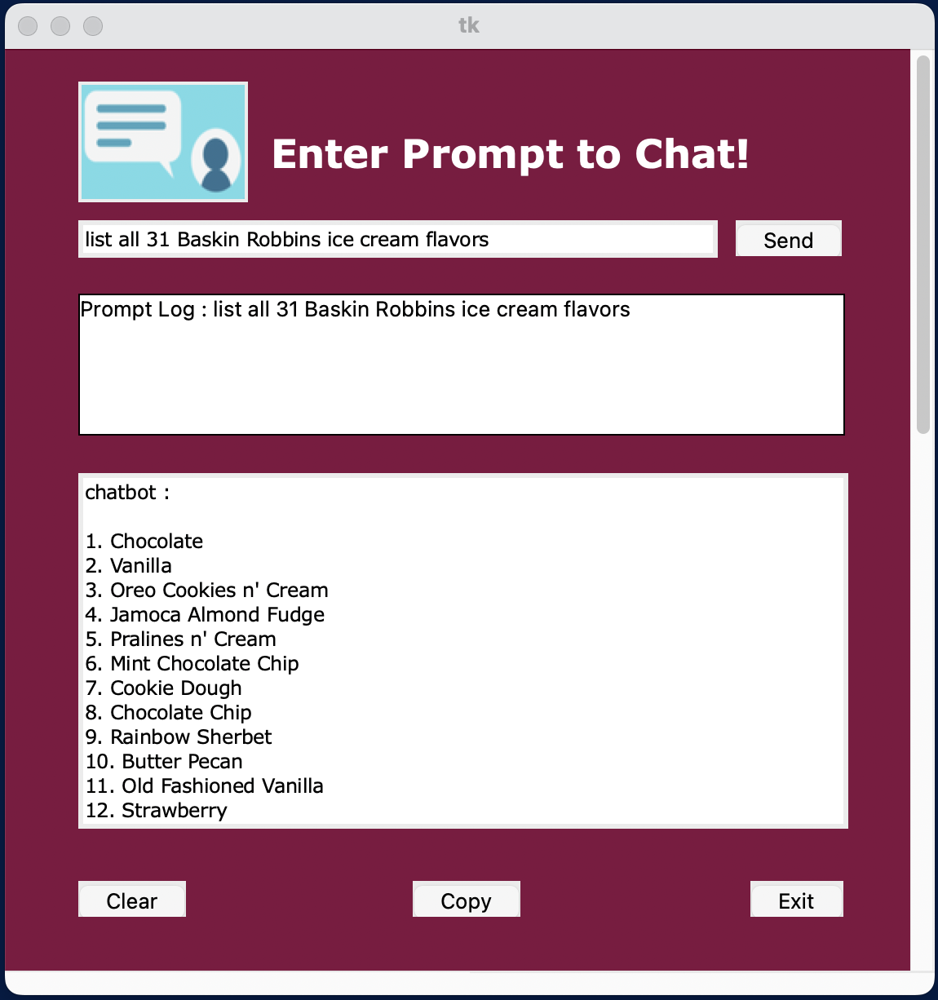

# Python ChatGPT3 Chatbot app with TKinter GUI 

### Intro
Bring the functionality of ChatGPT3 to your desktop with this app that uses an OpenAI API key and the davinci model that allows the user to to enter prompts and have response display in a TKinter constructed GUI.

The code uses the OpenAI API to generate responses to user prompts, and inserts the prompts and responses into separate text boxes to keep track of the conversation history.

### Description
This app contains:
1. Prompt entry box to input user prompt
2. Send button to submit user prompt
3. Mapping of send button to keyboard 'Return' or 'Enter' key
4. Box to log and display prompts entered
5. Response box to display ChatGPT3 response
6. Clear button to clear text from each of the boxes
7. Copy button to copy response text to the clipboard
8. Quit button to exit app
9. Scroll bars for prompt log and response boxes

### Steps
1. Create an Account to obtain an API Key at:

   https://platform.openai.com/account/api-keys
2. Create a config.ini file in which to store secret API key to be accessed by program 
3. Use ConfigParser module to extract API key from config.ini
4. Select GPT-3.5 Model
5. Set up TKinter window
6. Set up text entry box for prompt
7. Set up Send button to submit prompt
8. Set up Response box
9. Set up prompt log box to display prompts entered
10. Set up horizontal scroll bar to view entirety of prompt
11. Set up clear button to clear contents of all text boxes
12. Set up a vertical scroll bar to view entirety of response
13. Map keyboard 'Return' key to Send button
14. Set up copy button to copy response contents to clipboard
15. Set up Quit Button to exit 
16. Finalize TKinter GUI
